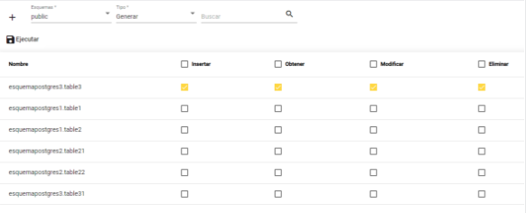
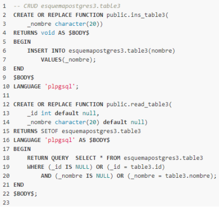
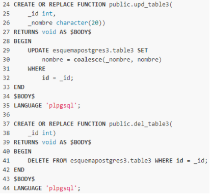

# FrontendCRUDBD2

Acerca de: Frontend del generador de CRUD's.

[Backend](https://github.com/SebastianRV26/BackendCRUD-BD2)

## Login

## Apartado de la información

## Apartado del código generado

## Integrantes:
* [Jairo Pacheco Campos](https://github.com/JairoPacheco)
* [Francisco Soto Quesada](https://github.com/franrsq)
* [Sebastián Rojas Vargas](https://github.com/SebastianRV26)

Curso: Bases de Datos 2. 
II Semestre 2020. 
Profesor: Leonardo Víquez Acuña.
